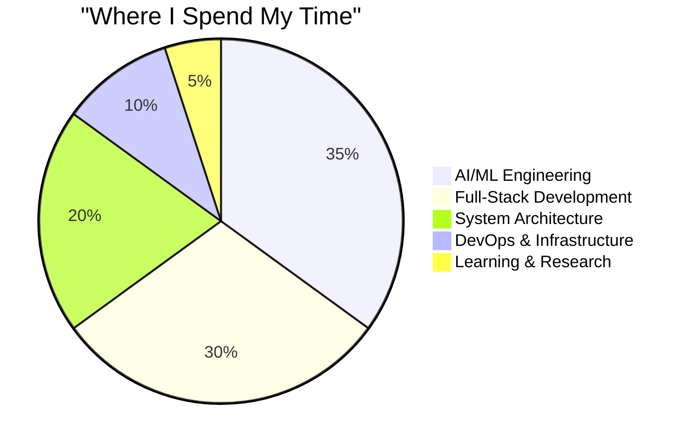

<div align="center">

<!-- ═══════════ ANIMATED HEADER ═══════════ -->


<br>
<br>

<!-- ═══════════ GLITCH NAME ═══════════ -->
<h1>

</h1>

<!-- ═══════════ STATUS BADGES ═══════════ -->


<br>
<br>

<!-- ═══════════ SOCIAL STRIP ═══════════ -->
<a href="https://github.com/alasrjadeed">
  
</a>


</div>

<br>

<!-- ═══════════════════════════════════════════ -->
<!--                ABOUT ME                    -->
<!-- ═══════════════════════════════════════════ -->


<div align="center">

##  About Me

</div>

<br>

<table>
<tr>
<td width="60%" valign="top">

> I don't just write code — I build **autonomous systems** that think, plan, execute, and improve themselves.

### What I Do

- **AI Systems Architect** — Designing multi-agent orchestration engines with 19 specialized AI agents, 8 AI providers, and RAG pipelines

- **Full-Stack Engineer** — Python, TypeScript, React, Next.js, FastAPI, NestJS, Flutter, Kotlin — from database to pixel

- **SaaS Product Founder** — Taking ideas from zero to production-ready platforms in weeks, not months

- **Automation Engineer** — Browser automation (Playwright), Desktop control, Voice systems (STT/TTS), Self-healing infrastructure

### Current Mission

Building **Lumina AI OS** — an autonomous AI Employee Operating System that plans, executes, tests, learns, and improves without human intervention.

</td>
<td width="40%" valign="top">

<div align="center">

###  Quick Stats



</div>

</td>
</tr>
</table>

<br>

<!-- ═══════════════════════════════════════════ -->
<!--              TECH ARSENAL                   -->
<!-- ═══════════════════════════════════════════ -->


<div align="center">

##  Tech Arsenal

</div>

<br>

<div align="center">

```
┌──────────────────────────────────────────────────────────────────────┐
│                    ⚡ LANGUAGES & RUNTIMES                          │
├──────────┬──────────┬──────────┬──────────┬──────────┬──────────────┤
│  Python  │   TypeScript │  Kotlin  │   Dart   │    PHP   │  JavaScript │
│ ████████ │  ███████ │  █████   │  ████    │  ████    │  ████        │
└──────────┴──────────┴──────────┴──────────┴──────────┴──────────────┘

┌──────────────────────────────────────────────────────────────────────┐
│                    🤖 AI & MACHINE LEARNING                        │
├──────────────┬──────────────┬──────────────┬────────────────────────┤
│  OpenAI/GPT  │ Google Gemini│   Ollama     │  TensorFlow/PyTorch   │
│  ████████    │  ████████    │  ██████      │  ██████               │
├──────────────┼──────────────┼──────────────┼────────────────────────┤
│  RAG Systems │  Multi-Agent │  Voice STT   │  Browser Automation   │
│  ████████    │  ████████    │  ██████      │  ██████               │
└──────────────┴──────────────┴──────────────┴────────────────────────┘

┌──────────────────────────────────────────────────────────────────────┐
│                    🏗️ BACKEND & FRAMEWORKS                         │
├──────────┬──────────┬──────────┬──────────┬──────────┬──────────────┤
│  FastAPI │  NestJS  │  Next.js │  React   │ Express  │   Laravel    │
│ ████████ │  ███████ │  ███████ │  ██████  │  █████   │  █████       │
└──────────┴──────────┴──────────┴──────────┴──────────┴──────────────┘

┌──────────────────────────────────────────────────────────────────────┐
│                    💾 DATA & INFRASTRUCTURE                        │
├──────────┬──────────┬──────────┬──────────┬──────────┬──────────────┤
│PostgreSQL│  Redis   │  Docker  │   K8s    │  BullMQ  │  Turborepo   │
│ ████████ │  ██████  │  ███████ │  ██████  │  █████   │  █████       │
└──────────┴──────────┴──────────┴──────────┴──────────┴──────────────┘
```

</div>

<br>

<div align="center">

<!-- Languages Row -->


<br><br>

<!-- AI Row -->


<br><br>

<!-- Frameworks Row -->


<br><br>

<!-- Infra Row -->


</div>

<br>

<!-- ═══════════════════════════════════════════ -->
<!--            FLAGSHIP PROJECTS                -->
<!-- ═══════════════════════════════════════════ -->


<div align="center">

##  Featured Projects

</div>

<br>

<div align="center">

<a href="https://github.com/alasrjadeed/Lumina-AI-OS">

</a>

<a href="https://github.com/alasrjadeed/Smile-Video-Studio">

</a>

</div>

<br>

<div align="center">

<a href="https://github.com/alasrjadeed/alasrjadeed.github.io">

</a>

<a href="https://github.com/alasrjadeed/whiteboard-app">

</a>

</div>

<br>

<!-- ═══════════════════════════════════════════ -->
<!--         ARCHITECTURE SHOWCASE              -->
<!-- ═══════════════════════════════════════════ -->


<div align="center">

##  What I Build

</div>

<br>

<div align="center">

### Lumina AI OS — Architecture

```
╔══════════════════════════════════════════════════════════════════════╗
║                    🧠 LUMINA AI OS                                  ║
║           Autonomous AI Employee Operating System                    ║
╠══════════════════════════════════════════════════════════════════════╣
║                                                                      ║
║  ┌──────────────┐  ┌──────────────┐  ┌──────────────┐              ║
║  │  🎯 CEO      │  │  💻 Engineer │  │  📊 Marketing │              ║
║  │  Orchestrator│  │  Agent       │  │  Manager     │              ║
║  └──────┬───────┘  └──────┬───────┘  └──────┬───────┘              ║
║         │                  │                  │                       ║
║         └──────────────────┼──────────────────┘                       ║
║                            │                                         ║
║                  ┌─────────▼─────────┐                               ║
║                  │   ⚡ Event Bus    │                               ║
║                  │   (Kernel)        │                               ║
║                  └─────────┬─────────┘                               ║
║                            │                                         ║
║  ┌──────────┐  ┌──────────▼──────────┐  ┌──────────┐               ║
║  │ 🧠 RAG  │  │   🔌 Plugin System  │  │ 🗣️ Voice│               ║
║  │ Ollama   │  │   57 Skills         │  │ STT/TTS  │               ║
║  │ Embeds   │  │   12 Presets        │  │ Wake Word│               ║
║  └──────────┘  └─────────────────────┘  └──────────┘               ║
║                                                                      ║
║  ┌──────────┐  ┌──────────┐  ┌──────────┐  ┌──────────┐           ║
║  │ 🌐      │  │ 🖥️       │  │ 📱       │  │ 🔧      │           ║
║  │ Browser │  │ Desktop  │  │ Mobile   │  │ VS Code  │           ║
║  │ Playwright│ │ Electron │  │ Flutter  │  │ Extension│           ║
║  └──────────┘  └──────────┘  └──────────┘  └──────────┘           ║
║                                                                      ║
╠══════════════════════════════════════════════════════════════════════╣
║  React Dashboard │ FastAPI Backend │ PostgreSQL │ Redis │ Docker K8s  ║
╚══════════════════════════════════════════════════════════════════════╝
```

</div>

<br>

<div align="center">

### Product Ecosystem

```
┌──────────────────────────────────────────────────────────────────┐
│                                                                 │
│  🎬 Smile          📊 Lumina        🔥 LeadForge               │
│  Video Studio      SEO              AI                         │
│  ─────────         ─────            ──────                     │
│  AI Video          Autonomous       B2B Lead                   │
│  Production        SEO/GEO/AEO      Generation                 │
│                                                                 │
│  🐾 PetMind        📸 Lumina        🎨 Whiteboard              │
│  AI                Repost           App                        │
│  ─────────         ─────            ──────                     │
│  AI Pet Care       Instagram        Collaborative              │
│  Companion         Automation       Learning                   │
│                                                                 │
│                    All Powered By LUMINA AI OS                   │
│                    ════════════════════════                     │
└──────────────────────────────────────────────────────────────────┘
```

</div>

<br>

<!-- ═══════════════════════════════════════════ -->
<!--            GITHUB STATS                    -->
<!-- ═══════════════════════════════════════════ -->


<div align="center">

##  GitHub Analytics

</div>

<br>

<div align="center">

<!-- Stats Cards -->


</div>

<br>

<div align="center">

<!-- Trophy -->
[](https://github.com/ryo-ma/github-profile-trophy)

</div>

<br>

<div align="center">

<!-- Streak -->


</div>

<br>

<!-- ═══════════════════════════════════════════ -->
<!--          ACTIVITY & CONTRIBUTIONS           -->
<!-- ═══════════════════════════════════════════ -->


<div align="center">

##  Activity Graph

</div>

<br>

[](https://github.com/ashutosh00710/github-readme-activity-graph)

<br>

<!-- ═══════════════════════════════════════════ -->
<!--            CONTRIBUTION SNAKE              -->
<!-- ═══════════════════════════════════════════ -->


<div align="center">

##  Contribution Snake

<br>


</div>

<br>

<!-- ═══════════════════════════════════════════ -->
<!--              CONNECT                       -->
<!-- ═══════════════════════════════════════════ -->


<div align="center">

##  Let's Connect

<br>

<a href="https://github.com/alasrjadeed">
  
</a>

<br>
<br>

---

<br>

<!-- ═══════════ VISITORS COUNTER ═══════════ -->


</div>
